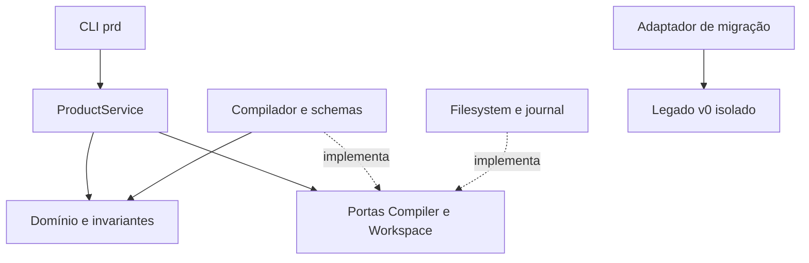

# Arquitetura

## Estilo

Monólito modular TypeScript, um pacote npm e um binário. Domínio computacional sem filesystem; aplicação depende de portas Compiler e Workspace. Adaptadores implementam parsing e persistência. bootstrap.ts é a composição. A fronteira é verificada por scripts/check-boundaries.mjs.

## Módulos

| Caminho | Responsabilidade |
| --- | --- |
| src/domain | Envelope, tipos, canonicalização, digest puro, decisões e grafo |
| src/application | Casos de uso, citações e transações controladas |
| src/application/ports | Compiler, Workspace e contratos futuros de aprovação/evidência |
| src/compiler | Parsing oficial YAML/Gherkin, schemas e diagnósticos semânticos |
| src/infrastructure | Filesystem, scaffold e migração |
| src/interfaces/cli | Argumentos, saída humana/JSON e exit codes |
| src/legacy/v0 | Compatibilidade preservada, sem acoplamento ao novo domínio |
| framework | Linguagem, schemas, perfis e matriz de capacidades |
| templates | Recursos distribuídos por init |

Nenhum novo código de domínio importa Commander, YAML, Ajv ou o legado. As mutações públicas de ProductService sempre adquirem lock e recarregam a baseline. A CLI não é responsável por lembrar essas etapas.

## Evolução

Separar pacotes apenas quando houver consumidores independentes e necessidade de versionamento. MCP será outro adaptador da aplicação. FEEL, prova modal e runtime de processos precisam de decisões arquiteturais específicas; não são plugins executados arbitrariamente a partir do YAML.

Toda saída para agentes deve preservar fontes, baseline e diagnósticos. O contexto é recuperado por grafo e não implica relevância semântica perfeita. A inferência do Copilot propõe artefatos; validadores determinísticos checam apenas as propriedades declaradas nos perfis.
